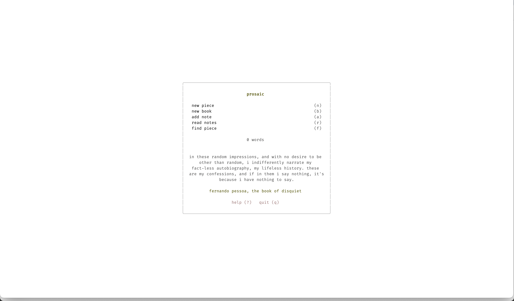
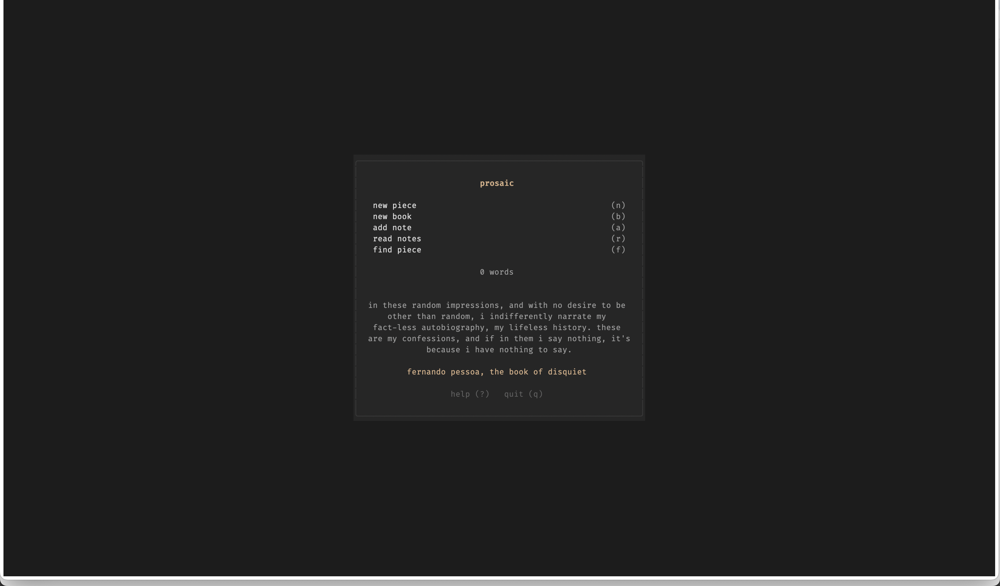
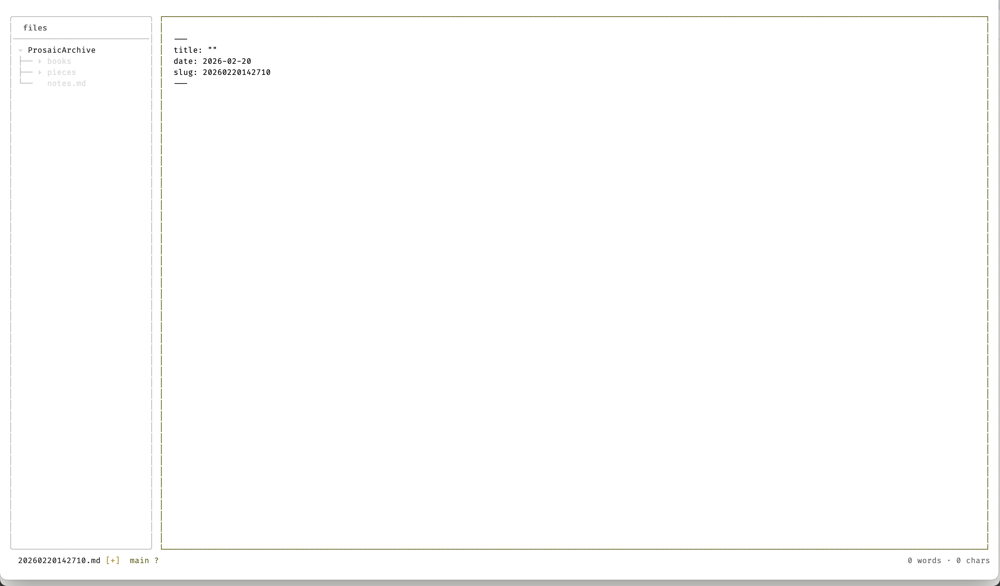
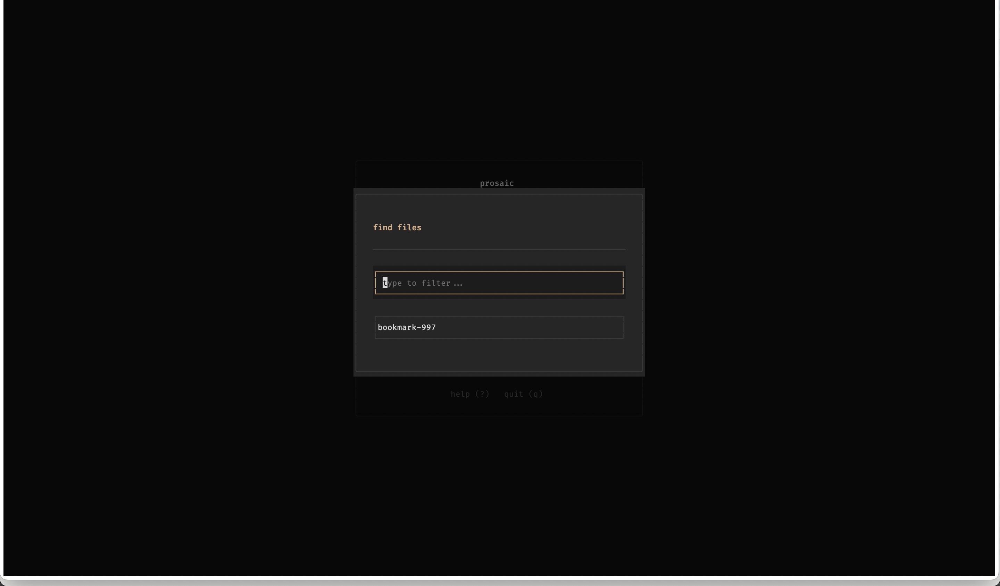
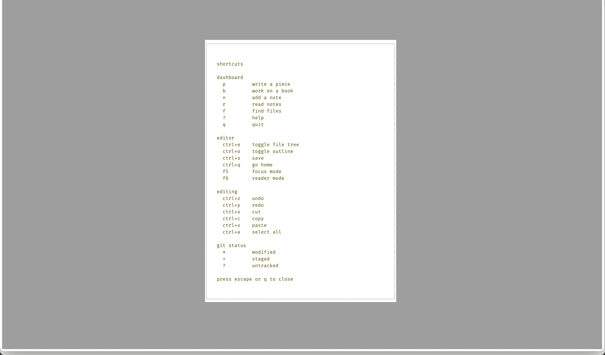
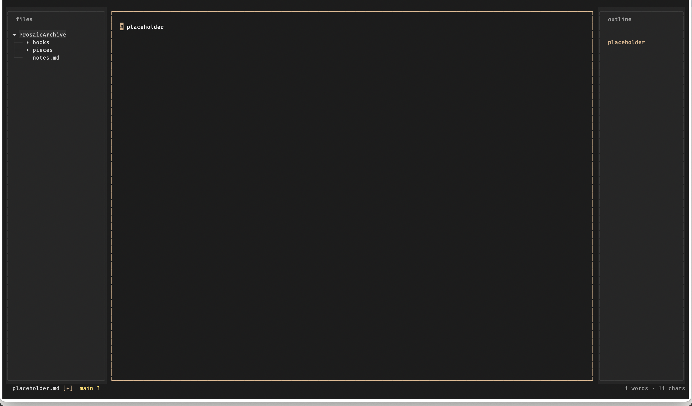

# Prosaic

A writer-first terminal writing app built with Python and Textual, built with the assistance of LLM/Copilot tools.

## Motivation

I write on multiple devices (an iPad, a laptop, even more), and I wanted a quick way to start every day, get some frontmatter ready for my daily pieces on [journal.coffee](https://journal.coffee), jot down notes and even work on books. I have tried several software, some stellar, some half-assed, some bloated, some minimal, but I felt like I needed something of my own.

So, I decided that the best way to go about it is to have a TUI. I can access it from anywhere, and mostly, it will do the job. This way, I can access it from a terminal app on the iPad or Windows (cue: Termix on a browser) and on the Macbook. Hence, Prosaic was born.

**Full disclosure:** I heavily relied on LLMs to make it, but as much as I could, I tried to get it to follow best practices, good architecture, and clean code principles.

## Publish with Ode

Looking somewhere to publish your writing that is philosophically compatible with Prosaic? Check out [Ode](https://ode.dimwit.me/). You can also go to the [GitHub](https://github.com/DeepanshKhurana/ode/) directly. 

> Ode is for writers who want to publish in an aesthetically pleasing website, ignoring the bells and whistles of the modern internet. It is opinionated, minimal, and easy to use, guided by an [Ethos](https://docs.ode.dimwit.me/ethos) that prioritizes the craft of writing and the joy of reading over metrics and engagement.

## Screenshots

| | |
|---|---|
|  |  |
|  |  |
|  |  |

## Installation

```bash
# Install (requires Python 3.11+)
pipx install prosaic

# Run (first launch runs setup wizard)
prosaic

# Re-run setup wizard anytime
prosaic --setup
```

## Features

- **Markdown-first**: Live outline, word counting
- **Focus mode**: Hide everything except your writing
- **Reader mode**: Distraction-free reading
- **Daily metrics**: Track words and characters written each day
- **Git-ready**: Archive is Git-initialized for versioning

## Keybindings

| Category | Key | Action |
|----------|-----|--------|
| Dashboard | `p` | Write a piece |
| Dashboard | `b` | Work on a book |
| Dashboard | `n` | Add a note |
| Dashboard | `r` | Read notes |
| Dashboard | `f` | Find files |
| Dashboard | `?` | Help |
| Dashboard | `q` | Quit |
| Editor | `Ctrl+e` | Toggle file tree |
| Editor | `Ctrl+o` | Toggle outline |
| Editor | `Ctrl+s` | Save |
| Editor | `Ctrl+q` | Go home |
| Editor | `F5` | Focus mode |
| Editor | `F6` | Reader mode |
| Writing | `Ctrl+z` | Undo |
| Writing | `Ctrl+y` | Redo |
| Writing | `Ctrl+x` | Cut |
| Writing | `Ctrl+c` | Copy |
| Writing | `Ctrl+v` | Paste |
| Writing | `Ctrl+a` | Select all |

## Themes

- **Prosaic Light** (default): Warm white background with brick accents
- **Prosaic Dark**: Deep charcoal with warm tan accents

```bash
# Light mode (default)
prosaic

# Dark mode
prosaic --dark
```

## Configuration

Config location (in order of priority):
1. `PROSAIC_CONFIG_DIR` env var (explicit override)
2. `$XDG_CONFIG_HOME/prosaic/` (Linux standard)
3. `~/.config/prosaic/` (default)

Override with environment variable:

```bash
PROSAIC_CONFIG_DIR=~/custom/path prosaic
```

### Git Integration

If your chosen archive directory already contains a git repository, the wizard will:

- Detect the existing `.git` directory
- Inherit the repository (no re-initialization)
- Read the remote URL if configured
- Prompt for a remote URL if none exists
- Store this info in `settings.json`

Example `settings.json`:

```json
{
  "setup_complete": true,
  "archive_dir": "/Users/you/Prosaic",
  "init_git": true,
  "git_remote": "git@github.com:you/writing.git",
  "git_inherited": true
}
```

## Archive Structure

```
~/Prosaic/              # Default archive (configurable)
  pieces/               # Pieces with preloaded markdown frontmatter
  books/                # Long-form projects with Outline already open
  notes.md              # Quick notes with auto date headers
  metrics.json          # Daily statistics for archival and display
  .git/                 # Version control
```

## License

MIT
